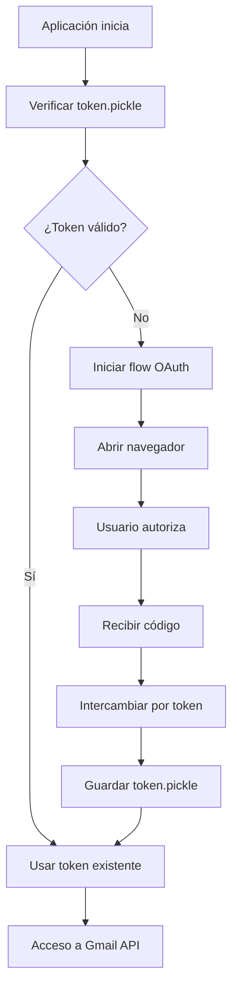

# ==========================================
# GUÍA DE CONFIGURACIÓN OAUTH PARA GMAIL
# ==========================================

## 🎯 Problema Identificado

Tu cuenta `jpmarichal@train.missionary.org` NO tiene contraseña tradicional y toda la autenticación se realiza mediante **OAuth 2.0**.

## ✅ Solución Implementada

He actualizado el sistema para **soportar OAuth 2.0** como método primario de autenticación, con **IMAP como fallback**.

### **Cambios Realizados:**

1. **📦 Nuevas Dependencias:**
   - `google-api-python-client` - Cliente oficial de Google APIs
   - `google-auth` - Librerías de autenticación OAuth
   - `google-auth-oauthlib` - Flow OAuth simplificado

2. **🔧 Configuración OAuth:**
   ```env
   # Variables OAuth (primarias)
   GMAIL_USER=jpmarichal@train.missionary.org
   GOOGLE_APPLICATION_CREDENTIALS=/app/credentials.json
   GOOGLE_TOKEN_PATH=/app/token.pickle

   # Variables IMAP (fallback - opcionales)
   GMAIL_APP_PASSWORD=
   IMAP_SERVER=imap.gmail.com
   IMAP_PORT=993
   ```

3. **🏗️ Servicios Implementados:**
   - `GmailOAuthService` - Manejo de Gmail API con OAuth
   - `EmailService` - Wrapper que detecta automáticamente qué método usar

## 🚀 Pasos para Configurar OAuth

### **Paso 1: Crear Proyecto en Google Cloud Console**

1. **Ir a [Google Cloud Console](https://console.cloud.google.com/)**
2. **Crear nuevo proyecto** o seleccionar existente
3. **Habilitar APIs**:
   - Buscar "Gmail API"
   - Habilitar "Gmail API"
4. **Crear Credenciales OAuth 2.0**:
   - Ir a "Credenciales" → "Crear Credenciales" → "ID de cliente OAuth"
   - **Tipo de aplicación**: "Aplicación de escritorio"
   - **Descargar JSON** de credenciales

### **Paso 2: Configurar Variables de Entorno**

```bash
# Copiar plantilla
cp .env.example .env

# Editar .env con:
GMAIL_USER=jpmarichal@train.missionary.org
GOOGLE_APPLICATION_CREDENTIALS=/app/credentials.json
GOOGLE_TOKEN_PATH=/app/token.pickle
```

### **Paso 3: Colocar Archivos de Credenciales**

```bash
# Crear directorio para credenciales (en el contenedor)
mkdir -p /app

# Copiar archivo credentials.json descargado
# El archivo se debe montar en:
/app/credentials.json
```

### **Paso 4: Primera Ejecución - Flow OAuth**

```bash
# Ejecutar la aplicación
python -m uvicorn app.main:app --reload

# O usar Docker
docker run -v $(pwd):/app -p 8000:8000 email-service

# El sistema automáticamente:
# 1. Detectará que usas OAuth
# 2. Iniciará el flow OAuth en el navegador
# 3. Solicitará permisos para Gmail
# 4. Guardará el token en token.pickle
```

## 🔍 Cómo Funciona la Autenticación

### **Flujo OAuth 2.0:**



### **Permisos Solicitados:**
- ✅ **Leer correos** (para buscar y procesar)
- ✅ **Modificar etiquetas** (para marcar como procesado)
- ✅ **Gestionar etiquetas** (crear etiqueta si no existe)

## 🆚 Comparación: OAuth vs IMAP

| **Aspecto** | **OAuth 2.0** | **IMAP + App Password** |
|-------------|---------------|-------------------------|
| **Seguridad** | ✅ **Más seguro** | ⚠️ Menos seguro |
| **Setup** | 🔧 Configuración inicial | ⚠️ Requiere app password |
| **Mantenimiento** | ✅ Token automático | ⚠️ Password manual |
| **Permisos** | 🎯 Granular | ⚠️ Acceso total |
| **Límite API** | 1,000,000,000 quota | 250,000,000 quota |

## ⚙️ Configuración Docker

### **docker-compose.yml:**
```yaml
version: '3.8'
services:
  email-service:
    build: .
    ports:
      - "8000:8000"
    env_file:
      - .env
    volumes:
      - ./credentials.json:/app/credentials.json:ro
      - ./token.pickle:/app/token.pickle
      - ./logs:/app/logs
```

### **Comando de construcción:**
```bash
# Construir imagen
docker build -t email-service .

# Ejecutar con volumen para credenciales
docker run -v $(pwd)/credentials.json:/app/credentials.json \
           -p 8000:8000 \
           email-service
```

## 🧪 Testing de OAuth

### **Endpoint de Test:**
```bash
# Test de conexión
curl http://localhost:8000/health

# Buscar emails (para debugging)
curl "http://localhost:8000/emails/search?query=subject:Misioneros"
```

### **Logs durante OAuth:**
```json
{
  "timestamp": "2024-01-15T10:30:00Z",
  "level": "INFO",
  "logger": "app.services.gmail_oauth_service",
  "message": "🔐 Iniciando flow OAuth",
  "event": "oauth_flow_start"
}
```

## 🔒 Seguridad

### **Archivos Sensibles:**
- ✅ `credentials.json` - **NUNCA** commitear
- ✅ `token.pickle` - **NUNCA** commitear
- ✅ `.env` - **NUNCA** commitear

### **Variables Protegidas:**
```bash
# En .gitignore
credentials.json
token.pickle
*.env
```

## 🚨 Troubleshooting OAuth

### **Error: "No se encontró archivo de credenciales"**
```bash
# Verificar que credentials.json existe
ls -la /app/credentials.json

# Verificar permisos
chmod 600 /app/credentials.json
```

### **Error: "Flow OAuth fallido"**
```bash
# Eliminar token corrupto
rm -f /app/token.pickle

# Reintentar autenticación
docker restart email-service
```

### **Error: "Insufficient Permission"**
```bash
# Verificar scopes en Google Cloud Console
# Ir a APIs & Credentials → OAuth 2.0 Client IDs
# Verificar Redirect URIs y scopes
```

## 📊 Ventajas de OAuth

1. **✅ Sin contraseña** - No necesitas app password
2. **✅ Más seguro** - Tokens con expiración automática
3. **✅ Mayor quota** - 1B vs 250M de requests/mes
4. **✅ Permisos granulares** - Solo acceso necesario
5. **✅ Mantenimiento automático** - Refresh tokens automático

## 🎯 Próximos Pasos

1. **Configurar Google Cloud Project**
2. **Descargar credentials.json**
3. **Configurar variables de entorno**
4. **Primera ejecución con OAuth flow**
5. **Verificar funcionamiento con emails reales**

¿Te gustaría que te ayude con algún paso específico de la configuración OAuth?
