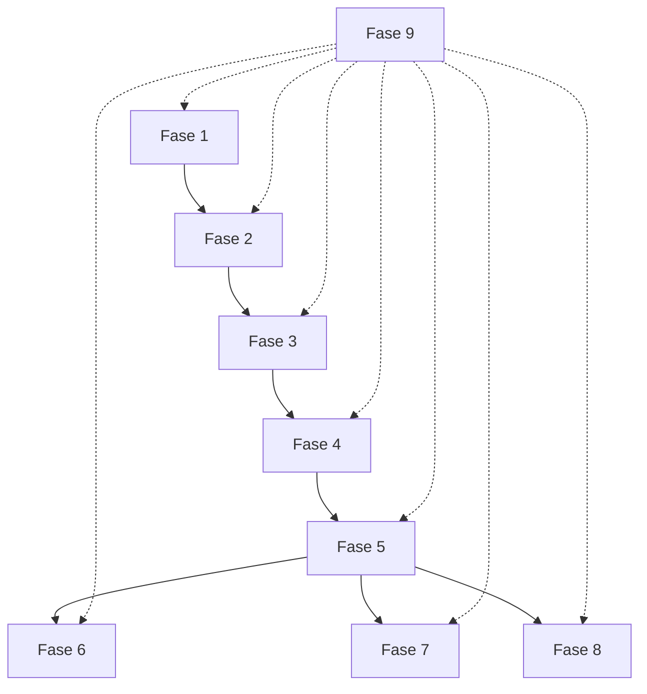

# Plan de Trabajo por Fases - Aplicación CCM

## Introducción
Este documento detalla el plan de trabajo específico para cada fase del workflow de la aplicación del Centro de Capacitación Misional México (CCM). Basado en el diagrama de secuencia del workflow, cada acción representa una fase específica del proceso.

## Fases del Proyecto

### Fase 1: Recepción de Email
**Objetivo**: Staff del CCM envía correo con información de nuevos misioneros

**Actividades**:
- ✅ **Espera de correo**: Monitoreo pasivo de la cuenta de correo
- ✅ **Detección automática**: Identificación por asunto y contenido
- ✅ **Registro inicial**: Logging del correo recibido (`ProcessingResult` documenta cada mensaje).
- ✅ **Validación básica**: Verificación de estructura básica (cabeceras, adjuntos mínimos).

**Entregables**:
- Registro de correo en sistema de logs (structlog con `message_id`, `attachments_count`, `validation_errors`).
- Confirmación de recepción automática.

**Recursos**:
- Acceso a cuenta Gmail/IMAP
- Librerías de monitoreo de email

**Estado**: ✅ **Configuración básica operativa**

---

### Fase 2: Procesamiento Inicial del Email
**Objetivo**: Email Service recibe, valida y extrae información del correo

**Actividades**:
- ✅ **Descarga de anexos**: Extracción de archivos PDF y XLSX
- ✅ **Análisis de asunto**: Identificación del patrón de llegada
- ✅ **Extracción de fecha**: Obtención de "Generación del..." del cuerpo
- ✅ **Validación de estructura**: Verificación de archivos requeridos
- ✅ **Parsing de tabla HTML**: Extracción de datos adicionales del cuerpo (`parsed_table` en `ProcessingResult`)
- ✅ **Manejo de errores**: Validación de formato y contenido (`table_errors` con códigos `column_missing`, `value_missing`, `html_missing`)
 - ✅ **Logging estructurado**: Registro de resultados por correo (éxitos y errores) listo para auditoría.

**Entregables**:
- Archivos descargados en almacenamiento temporal
- Fecha de generación formateada (YYYYMMDD)
- Validación exitosa de estructura de correo
- Detalles de procesamiento (`ProcessingResult.details`) con trazabilidad completa

**Recursos**:
- Librerías: `imapclient`, `email`, `beautifulsoup4`
- Almacenamiento temporal local/docker

**Estado**: ✅ **Operativo**

---

### Fase 3: Organización en Google Drive
**Objetivo**: Subida y organización sistemática de archivos en Google Drive

**Actividades**:
- ✅ **Autenticación Google**: Configuración de credenciales API
- ✅ **Creación de carpeta**: Carpeta nombrada con fecha (YYYYMMDD)
- ✅ **Renombrado de archivos**: Prefijo fecha + número distrito
- ✅ **Subida de PDFs y XLSX**: Transferencia de archivos de fotos y datos mediante `DriveService`.
- ✅ **Verificación de integridad**: Confirmación de subida exitosa y captura de IDs.
- ✅ **Limpieza temporal**: Eliminación de archivos temporales tras carga exitosa.

**Entregables**:
- Carpeta creada en Google Drive con fecha
- Archivos renombrados correctamente
- Enlaces permanentes a archivos

**Recursos**:
- Google Drive API (`google-api-python-client`)
- Credenciales OAuth 2.0
- Espacio de almacenamiento en Drive

**Estado**: ✅ **Configuración básica completada**

---

### Fase 4: Procesamiento e Inserción en MySQL
**Objetivo**: Database Service procesa archivos XLSX e inserta datos estructurados

**Actividades**:
- ✅ **Conexión a base de datos**: Establecimiento de conexión MySQL
- ✅ **Lectura de archivos XLSX**: Parsing con librerías especializadas
- ✅ **Mapeo de datos**: Transformación a estructura de base de datos
- ✅ **Validación de datos**: Verificación de integridad y consistencia
- ✅ **Inserción masiva**: Bulk insert en lotes de 50 usando `sqlalchemy`/`pymysql`.
- ✅ **Manejo de transacciones**: Commit por lote y rollback ante excepciones.
- ✅ **Tokens de reanudación**: Estado persistido en `data/state/database_sync_state.json`.
- ℹ️ **Encadenamiento con Fase 3**: Automatización diferida a fase posterior.

**Entregables**:
- Registros insertados en tabla `ccm_generaciones`
- `DatabaseSyncReport` con métricas por archivo (insertados/omitidos, duración)
- Logs estructurados en español con claves `message_id`, `etapa`, `records_processed`, `error_code`

**Recursos**:
- MySQL Server 8.0+
- Librerías: `sqlalchemy`, `pymysql`, `openpyxl`
- Schema de base de datos diseñado (tabla `ccm_generaciones`)

**Estado**: ✅ **Fase completada (endpoint `/extraccion_generacion` publicado)**

---

### Fase 5: Preparación de Datos para Reportes
**Objetivo**: Database Service organiza y prepara datos para generación de reportes

**Actividades**:
- ✅ **Consulta de rama específica**: Filtrado automático según `RAMA_ACTUAL` y ramas permitidas
- ✅ **Agrupación de datos multinivel**: Organización por zona/distrito replicando lógica de `scripts_google/ConsolidarReporte.gs.js`
- ✅ **Cálculos adicionales**: Estadísticas derivadas y métricas de consolidado/Branch in a Glance
- ✅ **Cache de resultados**: Estrategias `InMemoryCacheStrategy` y `RedisCacheStrategy` con métricas (`hits`, `misses`, `invalidations`)
- ✅ **Validación de datos**: Reglas de consistencia (`invalid_total_missionaries`, `invalid_kpi_value`, `dataset_missing_rows`)
- ✅ **Formateo inicial**: Serialización con DTOs Pydantic (`BranchSummary`, `DistrictKPI`, `UpcomingArrival`, `UpcomingBirthday`)
- ✅ **Diseño con patrones**: Fachada `ReportPreparationService`, Template Method en `BaseDatasetPipeline`, Builders y Observer para invalidación

**Entregables**:
- ✅ Servicio de datasets (`src/app/services/report_preparation_service.py`) expone pipelines reutilizables
- ✅ DTOs/serializadores en `src/app/models.py` con `message_id` para trazabilidad
- ✅ Capa de caché parametrizable con TTL y métricas de rendimiento
- ✅ Validadores y logs estructurados en español (`etapa="fase_5_preparacion"`, `dataset_id`, `cache_metrics`, `message_id`)
- ✅ Tests unitarios e integración (`tests/test_report_preparation_service.py`, `tests/integration/test_report_preparation_integration.py`) cubren casos exitosos y fallos

**Recursos**:
- Consultas SQL optimizadas y vistas `vwMisioneros`, `vwFechasCCMPorDistrito`, `vwCumpleanosProximos`
- Estrategias de caché configurables (memoria/Redis) según `.env`
- Variables `.env`: `RAMA_ACTUAL`, `CACHE_PROVIDER`, `REPORT_CACHE_TTL_MINUTES`, `REDIS_URL`
- Librerías: `sqlalchemy`, `pandas`, `redis` (opcional)
- Patrones de diseño consolidados (Facade, Strategy, Template Method, Builder, Observer)

- **Estado**: ✅ **Fase completada (servicio de datasets listo para consumo de reportes)**

---

### Fase 6: Generación de Reportes por Telegram
**Objetivo**: Report Service envía notificaciones push automáticas
{{ ... }}
**Actividades**:
- ✅ **Configuración de bot**: Token y credenciales de Telegram
- ✅ **Formateo de mensaje**: Estructura de notificación clara
- ⏳ **Identificación de destinatarios**: Lista de chats/grupos
- ⏳ **Envío de notificaciones**: Mensajes push automáticos
- ⏳ **Manejo de respuestas**: Posible interacción básica
- ⏳ **Logging de envíos**: Registro de mensajes enviados

**Entregables**:
- Mensajes enviados exitosamente
- Notificaciones de distritos que llegan
- Alertas de próximos cumpleaños
- Log de interacciones

**Recursos**:
- Telegram Bot API (`python-telegram-bot`)
- Token de bot configurado
- Lista de destinatarios autorizados

**Estado**: ✅ **Configuración básica completada**

---

### Fase 7: Distribución por Correo Electrónico
**Objetivo**: Envío de reportes detallados por email a contactos específicos

**Actividades**:
- ✅ **Configuración SMTP**: Servidor de correo saliente
- ✅ **Plantillas de email**: HTML templates para reportes
- ✅ **Lista de destinatarios**: Configuración de contactos
- ⏳ **Generación de contenido**: Formateo específico por email
- ⏳ **Adjuntos**: Inclusión de archivos si es necesario
- ⏳ **Personalización**: Emails adaptados por destinatario
- ⏳ **Seguimiento**: Confirmación de entrega y lectura

**Entregables**:
- Emails enviados correctamente
- Reportes personalizados por destinatario
- Confirmaciones de entrega
- Log de comunicaciones

**Recursos**:
- Servidor SMTP (Gmail/outlook)
- Librerías: `smtplib`, `email`, `jinja2`
- Plantillas HTML responsive

**Estado**: ✅ **Configuración básica completada**

---

### Fase 8: Generación en Google Sheets
**Objetivo**: Creación automática de hoja de cálculo para análisis

**Actividades**:
- ✅ **Autenticación Google Sheets**: API de hojas de cálculo
- ✅ **Creación de hoja**: Nueva spreadsheet por generación
- ⏳ **Estructura de datos**: Headers y formato apropiado
- ⏳ **Poblado de datos**: Inserción masiva de información
- ⏳ **Fórmulas y formato**: Cálculos automáticos y estilos
- ⏳ **Compartición automática**: Permisos para usuarios autorizados
- ⏳ **Historial de versiones**: Backup automático de cambios

**Entregables**:
- Hoja de cálculo creada y poblada
- Acceso compartido con líderes relevantes
- Formato "Branch in a Glance" implementado
- Enlace permanente para acceso

**Recursos**:
- Google Sheets API
- Credenciales de servicio OAuth
- Plantilla de formato predefinida

**Estado**: ✅ **Configuración básica completada**

---

### Fase 9: Monitoreo y Mantenimiento
**Objetivo**: Supervisión continua del sistema y mantenimiento

**Actividades**:
- ⏳ **Monitoreo de servicios**: Health checks automáticos
- ⏳ **Logs centralizados**: Recolección y análisis de logs
- ⏳ **Alertas automáticas**: Notificaciones de fallos
- ⏳ **Backups regulares**: Respaldo de base de datos y archivos
- ⏳ **Actualizaciones**: Mantenimiento de dependencias
- ⏳ **Optimización**: Mejora continua de rendimiento

**Entregables**:
- Dashboard de monitoreo
- Reportes de uptime y rendimiento
- Plan de mantenimiento documentado
- Procedimientos de recuperación

**Recursos**:
- Herramientas de monitoreo (Prometheus/Grafana)
- Sistema de logs (ELK Stack)
- Scripts de automatización

**Estado**: ⏳ **Pendiente de implementación**

---

## Dependencias entre Fases

## Estado General del Proyecto

### Progreso Actual (actualizado a cierre de Fase 4)
- ✅ **Actividades completadas**: 70% (Fases 1-4 operativas, configuraciones base de fases 5-8 listas)
- ⏳ **Actividades pendientes**: 25% (Reportes automáticos, monitoreo, encadenamiento pendiente)
- 🔄 **Actividades en progreso**: 5% (Pruebas de integración y automatizaciones diferidas)

### Recursos Críticos

**Personal**:
- Desarrollador full-stack (1 persona)
- DevOps engineer (0.5 persona)

**Tiempo**:
- Tiempo estimado total: 12 semanas
- Tiempo transcurrido: 6 semanas
- Tiempo restante estimado: 6 semanas

**Presupuesto**:
- Costos de infraestructura cloud: $50-100/mes
- APIs (Google, Telegram): $0-50/mes
- Herramientas de desarrollo: $0 (open source)

**Herramientas**:
- Docker y Docker Compose
- Git y GitHub
- CI/CD pipeline (GitHub Actions)
- IDE (VS Code/PyCharm)

---

## Próximos Pasos Inmediatos (ajustados tras Fase 4)

1. **Semana 8**: Profundizar en Fase 6 (Telegram) con endpoints dedicados y pruebas de envío.
2. **Semana 9**: Activar Fase 7 (correo) con plantillas HTML definitivas y manejo de adjuntos.
3. **Semana 10**: Completar Fase 8 (Google Sheets) con estructura Branch in a Glance y automatización de permisos.
4. **Semana 11**: Encadenar fases 6-8 con Fase 5, habilitando invalidación de cachés y reintentos/backoff.
5. **Semana 12**: Desarrollar Fase 9 (monitoreo, alertas y backups), pruebas finales y handoff.

## Métricas de Éxito

- ✅ Todos los correos semanales procesados automáticamente (Fases 1-4 listas)
- ⚠️ Reportes generados y distribuidos correctamente (pendiente de Fases 5-8)
- ℹ️ Tiempo de procesamiento < 30 minutos por correo (medición formal en próxima fase)
- ℹ️ Disponibilidad del sistema > 99% (monitoreo pendiente)
- ℹ️ Backups automáticos funcionando (programar en Fase 9)
- ✅ Logs estructurados y accesibles (structlog + `DatabaseSyncReport`)

---

*Este plan se actualizará semanalmente según el progreso real del proyecto.*
