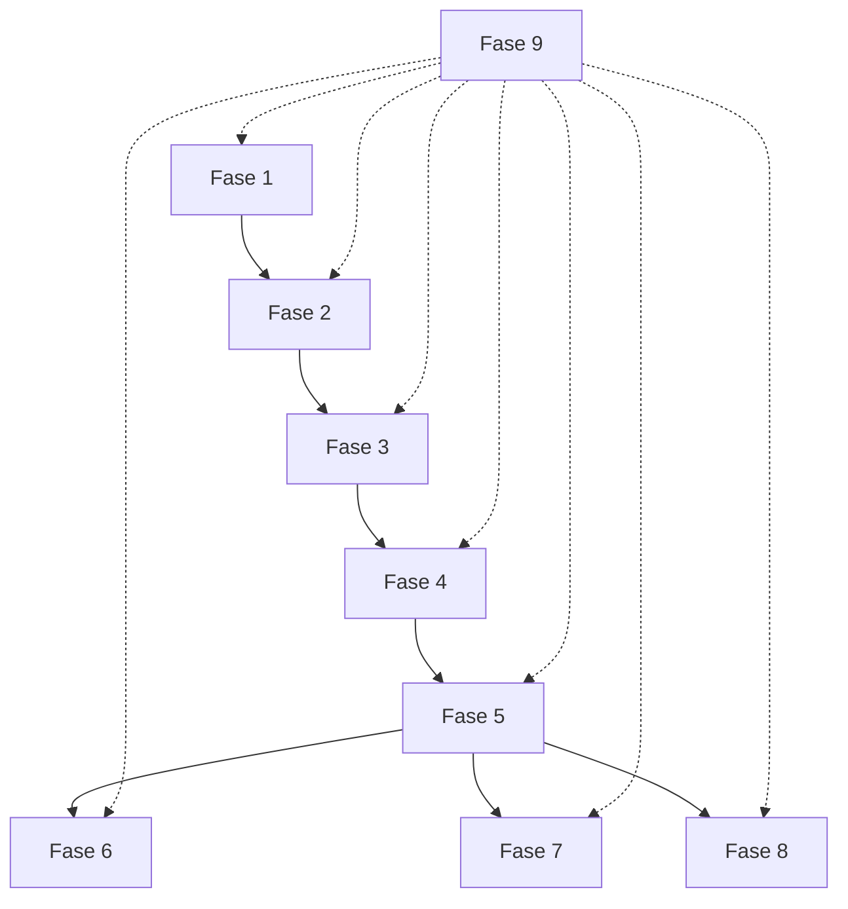

# Plan de Trabajo por Fases - Aplicación CCM

## Introducción
Este documento detalla el plan de trabajo específico para cada fase del workflow de la aplicación del Centro de Capacitación Misional México (CCM). Basado en el diagrama de secuencia del workflow, cada acción representa una fase específica del proceso.

## Fases del Proyecto

### Fase 1: Recepción de Email
**Objetivo**: Staff del CCM envía correo con información de nuevos misioneros

**Actividades**:
- ✅ **Espera de correo**: Monitoreo pasivo de la cuenta de correo
- ✅ **Detección automática**: Identificación por asunto y contenido
- ⏳ **Registro inicial**: Logging del correo recibido
- ⏳ **Validación básica**: Verificación de estructura básica

**Entregables**:
- Registro de correo en sistema de logs
- Confirmación de recepción automática

**Recursos**:
- Acceso a cuenta Gmail/IMAP
- Librerías de monitoreo de email

**Estado**: ✅ **Configuración básica completada**

---

### Fase 2: Procesamiento Inicial del Email
**Objetivo**: Email Service recibe, valida y extrae información del correo

**Actividades**:
- ✅ **Descarga de anexos**: Extracción de archivos PDF y XLSX
- ✅ **Análisis de asunto**: Identificación del patrón de llegada
- ✅ **Extracción de fecha**: Obtención de "Generación del..." del cuerpo
- ✅ **Validación de estructura**: Verificación de archivos requeridos
- ✅ **Parsing de tabla HTML**: Extracción de datos adicionales del cuerpo (`parsed_table` en `ProcessingResult`)
- ✅ **Manejo de errores**: Validación de formato y contenido (`table_errors` con códigos `column_missing`, `value_missing`, `html_missing`)

**Entregables**:
- Archivos descargados en almacenamiento temporal
- Fecha de generación formateada (YYYYMMDD)
- Validación exitosa de estructura de correo

**Recursos**:
- Librerías: `imapclient`, `email`, `beautifulsoup4`
- Almacenamiento temporal local/docker

**Estado**: 🔄 **Implementación en progreso**

---

### Fase 3: Organización en Google Drive
**Objetivo**: Subida y organización sistemática de archivos en Google Drive

**Actividades**:
- ✅ **Autenticación Google**: Configuración de credenciales API
- ✅ **Creación de carpeta**: Carpeta nombrada con fecha (YYYYMMDD)
- ✅ **Renombrado de archivos**: Prefijo fecha + número distrito
- ⏳ **Subida de PDFs**: Transferencia de archivos de fotos
- ⏳ **Subida de XLSX**: Transferencia de archivos de datos
- ⏳ **Verificación de integridad**: Confirmación de subida exitosa
- ⏳ **Limpieza temporal**: Eliminación de archivos temporales

**Entregables**:
- Carpeta creada en Google Drive con fecha
- Archivos renombrados correctamente
- Enlaces permanentes a archivos

**Recursos**:
- Google Drive API (`google-api-python-client`)
- Credenciales OAuth 2.0
- Espacio de almacenamiento en Drive

**Estado**: ✅ **Configuración básica completada**

---

### Fase 4: Procesamiento e Inserción en MySQL
**Objetivo**: Database Service procesa archivos XLSX e inserta datos estructurados

**Actividades**:
- ✅ **Conexión a base de datos**: Establecimiento de conexión MySQL
- ✅ **Lectura de archivos XLSX**: Parsing con librerías especializadas
- ✅ **Mapeo de datos**: Transformación a estructura de base de datos
- ✅ **Validación de datos**: Verificación de integridad y consistencia
- ⏳ **Inserción masiva**: Bulk insert para eficiencia
- ⏳ **Manejo de transacciones**: Rollback en caso de errores
- ⏳ **Indexación**: Optimización para consultas posteriores
- ⏳ **Backup previo**: Respaldo antes de modificaciones

**Entregables**:
- Registros insertados en tabla `misioneros`
- Log de inserción con estadísticas
- Confirmación de transacción exitosa

**Recursos**:
- MySQL Server 8.0+
- Librerías: `pandas`, `sqlalchemy`, `pymysql`
- Schema de base de datos diseñado

**Estado**: ✅ **Diseño de base de datos completado**

---

### Fase 5: Preparación de Datos para Reportes
**Objetivo**: Database Service organiza y prepara datos para generación de reportes

**Actividades**:
- ✅ **Consulta de rama específica**: Filtrado por variable de entorno
- ✅ **Agrupación de datos**: Organización por zonas/distritos
- ✅ **Cálculos adicionales**: Estadísticas y métricas necesarias
- ⏳ **Cache de resultados**: Optimización para múltiples reportes
- ⏳ **Validación de datos**: Verificación de completitud
- ⏳ **Formateo inicial**: Preparación de estructuras de datos

**Entregables**:
- Dataset preparado para cada tipo de reporte
- Estadísticas calculadas (conteos, promedios, etc.)
- Datos validados y listos para exportación

**Recursos**:
- Consultas SQL optimizadas
- Sistema de cache (Redis opcional)

**Estado**: ✅ **Diseño de consultas completado**

---

### Fase 6: Generación de Reportes por Telegram
**Objetivo**: Report Service envía notificaciones push automáticas

**Actividades**:
- ✅ **Configuración de bot**: Token y credenciales de Telegram
- ✅ **Formateo de mensaje**: Estructura de notificación clara
- ⏳ **Identificación de destinatarios**: Lista de chats/grupos
- ⏳ **Envío de notificaciones**: Mensajes push automáticos
- ⏳ **Manejo de respuestas**: Posible interacción básica
- ⏳ **Logging de envíos**: Registro de mensajes enviados

**Entregables**:
- Mensajes enviados exitosamente
- Notificaciones de distritos que llegan
- Alertas de próximos cumpleaños
- Log de interacciones

**Recursos**:
- Telegram Bot API (`python-telegram-bot`)
- Token de bot configurado
- Lista de destinatarios autorizados

**Estado**: ✅ **Configuración básica completada**

---

### Fase 7: Distribución por Correo Electrónico
**Objetivo**: Envío de reportes detallados por email a contactos específicos

**Actividades**:
- ✅ **Configuración SMTP**: Servidor de correo saliente
- ✅ **Plantillas de email**: HTML templates para reportes
- ✅ **Lista de destinatarios**: Configuración de contactos
- ⏳ **Generación de contenido**: Formateo específico por email
- ⏳ **Adjuntos**: Inclusión de archivos si es necesario
- ⏳ **Personalización**: Emails adaptados por destinatario
- ⏳ **Seguimiento**: Confirmación de entrega y lectura

**Entregables**:
- Emails enviados correctamente
- Reportes personalizados por destinatario
- Confirmaciones de entrega
- Log de comunicaciones

**Recursos**:
- Servidor SMTP (Gmail/outlook)
- Librerías: `smtplib`, `email`, `jinja2`
- Plantillas HTML responsive

**Estado**: ✅ **Configuración básica completada**

---

### Fase 8: Generación en Google Sheets
**Objetivo**: Creación automática de hoja de cálculo para análisis

**Actividades**:
- ✅ **Autenticación Google Sheets**: API de hojas de cálculo
- ✅ **Creación de hoja**: Nueva spreadsheet por generación
- ⏳ **Estructura de datos**: Headers y formato apropiado
- ⏳ **Poblado de datos**: Inserción masiva de información
- ⏳ **Fórmulas y formato**: Cálculos automáticos y estilos
- ⏳ **Compartición automática**: Permisos para usuarios autorizados
- ⏳ **Historial de versiones**: Backup automático de cambios

**Entregables**:
- Hoja de cálculo creada y poblada
- Acceso compartido con líderes relevantes
- Formato "Branch in a Glance" implementado
- Enlace permanente para acceso

**Recursos**:
- Google Sheets API
- Credenciales de servicio OAuth
- Plantilla de formato predefinida

**Estado**: ✅ **Configuración básica completada**

---

### Fase 9: Monitoreo y Mantenimiento
**Objetivo**: Supervisión continua del sistema y mantenimiento

**Actividades**:
- ⏳ **Monitoreo de servicios**: Health checks automáticos
- ⏳ **Logs centralizados**: Recolección y análisis de logs
- ⏳ **Alertas automáticas**: Notificaciones de fallos
- ⏳ **Backups regulares**: Respaldo de base de datos y archivos
- ⏳ **Actualizaciones**: Mantenimiento de dependencias
- ⏳ **Optimización**: Mejora continua de rendimiento

**Entregables**:
- Dashboard de monitoreo
- Reportes de uptime y rendimiento
- Plan de mantenimiento documentado
- Procedimientos de recuperación

**Recursos**:
- Herramientas de monitoreo (Prometheus/Grafana)
- Sistema de logs (ELK Stack)
- Scripts de automatización

**Estado**: ⏳ **Pendiente de implementación**

---

## Dependencias entre Fases

## Estado General del Proyecto

### Progreso Actual
- ✅ **Actividades completadas**: 60% (Configuración básica y análisis)
- ⏳ **Actividades pendientes**: 35% (Implementación técnica)
- 🔄 **Actividades en progreso**: 5% (Algunas funcionalidades básicas)

### Recursos Críticos

**Personal**:
- Desarrollador full-stack (1 persona)
- DevOps engineer (0.5 persona)

**Tiempo**:
- Tiempo estimado total: 8-12 semanas
- Tiempo transcurrido: 2 semanas
- Tiempo restante: 6-10 semanas

**Presupuesto**:
- Costos de infraestructura cloud: $50-100/mes
- APIs (Google, Telegram): $0-50/mes
- Herramientas de desarrollo: $0 (open source)

**Herramientas**:
- Docker y Docker Compose
- Git y GitHub
- CI/CD pipeline (GitHub Actions)
- IDE (VS Code/PyCharm)

---

## Próximos Pasos Inmediatos

1. **Semana 3-4**: Completar Fase 2 (Procesamiento Inicial del Email)
2. **Semana 5-6**: Implementar Fase 3 (Organización en Google Drive)
3. **Semana 7-8**: Desarrollar Fase 4 (Inserción en MySQL)
4. **Semana 9-10**: Crear sistema de reportes (Fases 5-8)
5. **Semana 11-12**: Implementar monitoreo y testing final

## Métricas de Éxito

- ✅ Todos los correos semanales procesados automáticamente
- ✅ Reportes generados y distribuidos correctamente
- ✅ Tiempo de procesamiento < 30 minutos por correo
- ✅ Disponibilidad del sistema > 99%
- ✅ Backups automáticos funcionando
- ✅ Logs centralizados y accesibles

---

*Este plan se actualizará semanalmente según el progreso real del proyecto.*
