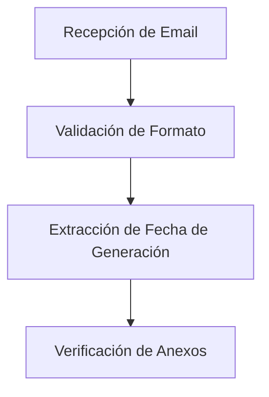
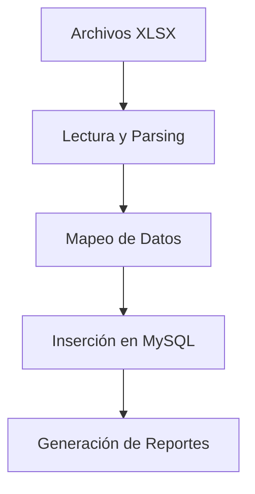
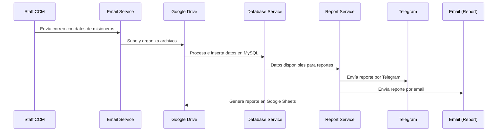

# Workflow de la Aplicación CCM - Centro de Capacitación Misional México

## Descripción General
La aplicación automatiza el procesamiento de información de misioneros que llegan al Centro de Capacitación Misional México (CCM). El workflow se basa en el monitoreo constante de una cuenta de Google (cuenta misional o cuenta CCM) y procesa semanalmente la información de nuevos distritos de misioneros.

## Contexto Organizacional

### Estructura Jerárquica del CCM
El CCM organiza a los misioneros en una estructura jerárquica bien definida:

- **Ramas/Zonas**: Unidades principales dirigidas por una presidencia de rama (3 varones) y asistidas por misioneros de servicio
- **Distritos**: Subdivisiones de las zonas con dos tipos específicos:
  - **Distritos de 6 semanas**: Para misioneros que necesitan aprender español
  - **Distritos de 3 semanas**: Para misioneros de habla hispana

### Composición de los Distritos
- **Compañerismos**: Grupos de 2-3 misioneros del mismo género
- **Ejemplo de composición**: Un distrito puede tener 2 compañerismos de hermanas y 4 de élderes

### Liderazgos Específicos
- **Líder de Distrito (LD)**: Responsable del distrito completo
- **Líder de Casa (LC)**: Compañero del LD, pertenecen al mismo compañerismo
- **Líderes de Zona (LZ)**: 2-3 líderes por zona, pertenecientes al mismo compañerismo
- **Hermanas Capacitadoras (HC)**: 2-3 por zona, compañeras entre sí

> **Nota**: Los LZ y HC son seleccionados de entre los compañerismos existentes en la zona.

## Proceso de Arribo Semanal

### Fuente de Información
Cada semana, la hermana Natalia Scarlett Leyva Flores (staff del CCM) envía un correo electrónico con:
- **Asunto**: Similar a "Misioneros que llegan el 3 de Octubre 2025"
- **Anexos**:
  - Fotografías de misioneros (archivos PDF por distrito)
  - Dos archivos XLSX con datos de misioneros (3 semanas y 6 semanas)

### Identificación del Correo
El sistema identifica automáticamente el correo relevante mediante:
- Patrón específico en el asunto
- Tabla en el cuerpo del correo con encabezado como "Generación del 22 de septiembre de 2025"

## Procesamiento Automatizado

### 1. Recepción y Validación

Fecha de generación se debe extraer de la tabla y cambiar el formato a 20250922 (YYYYMMDD) para procesamiento

### 2. Organización de Archivos
- **Creación de carpeta en Google Drive**: Nombrada con la fecha de generación (formato: YYYYMMDD)
- **Renombrado de archivos**: Prefijo con fecha de generación + número de distrito
  - Ejemplo: `20250922_14A.pdf`

### 3. Procesamiento de Datos

**Mapeo de Datos**:
- Estructuración de información de misioneros
- Normalización de campos
- Validación de integridad

### 4. Persistencia de Datos
- **Base de Datos**: MySQL
- **Tabla Principal**: Información de misioneros por rama/zona/distrito
- **Configuración**: Rama específica definida en archivo `.env`

## Generación de Reportes

### Tipos de Reportes
Una vez procesados los datos, el sistema genera automáticamente:

1. **Reporte en Google Sheets**:
   - Branch in a Glance
   
2. **Reportes por Telegram**:
   - Notificaciones push:
     - Distritos que llegan esta semana
     - Próximos cumpleaños
   
3. **Reportes por Correo Electrónico**:
   - Por determinar

### Configuración de Destinatarios
- **Rama específica**: Definida en variable de entorno a través de archivo .env
- **Frecuencia**: Automática después de cada procesamiento
- **Formato**: Adaptable según el medio de distribución

## Consideraciones Técnicas

### Automatización Completa
- **Monitoreo continuo**: Verificación periódica de nuevos correos
- **Procesamiento asíncrono**: Manejo eficiente de archivos grandes
- **Manejo de errores**: Reintentos automáticos y logging detallado
- **Notificaciones**: Alertas en caso de fallos en el procesamiento

### Seguridad y Privacidad
- **Acceso restringido**: Solo personal autorizado
- **Encriptación**: Datos sensibles protegidos en tránsito y reposo
- **Auditoría**: Registro completo de todas las operaciones

### Escalabilidad
- **Procesamiento por lotes**: Capacidad para múltiples correos simultáneos
- **Almacenamiento flexible**: Google Drive para archivos, MySQL para datos estructurados
- **Microservicios**: Arquitectura modular para mantenimiento y escalado

## Flujo de Trabajo Resumido

Este workflow asegura una gestión eficiente y automatizada de la información de misioneros, desde su arribo hasta la distribución de reportes para los líderes correspondientes.